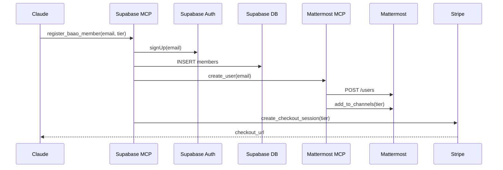
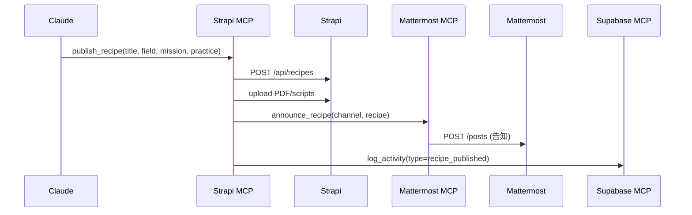
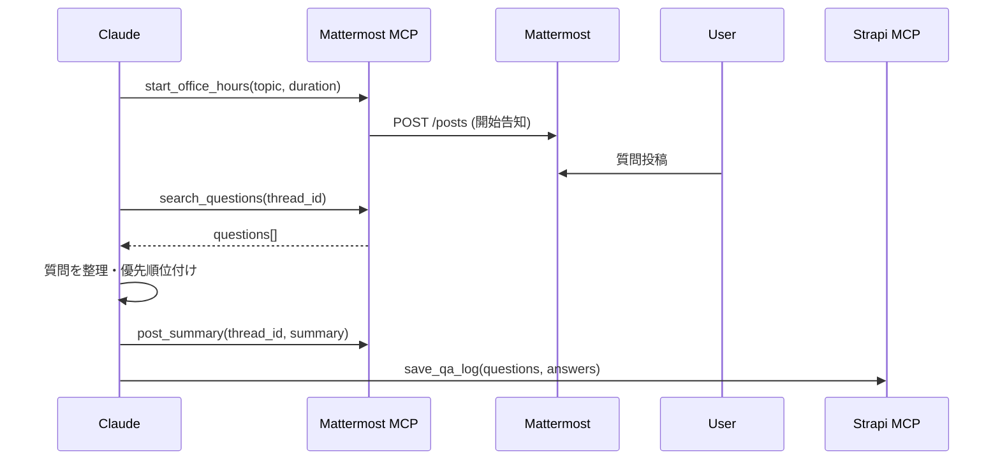

# チャット・会員管理・知識管理｜3本柱API完全制御プラットフォーム分析

**調査日**: 2025/10/05
**目的**: チャット・会員管理・知識管理をAPI完全制御できる最適構成の選定
**重視点**: 各機能がAPIで完全にデータ管理可能、MCP化可能

---

## エグゼクティブサマリー

**結論**: **Mattermost（チャット） + Supabase（会員管理） + Strapi（知識管理）** が最適。

**理由**:
1. **3本柱すべてがAPI完全制御可能**
2. **セルフホスト可能** - データ主権を保持
3. **MCP化実績あり** - すでにコミュニティ実装が存在
4. **オープンソース** - ロックインなし、カスタマイズ自由
5. **日本語対応完備** - UIも管理画面も日本語

---

## 1. 3本柱の要件定義

### 📱 チャット（Chat）

| 要件 | 必須/重要 | 説明 |
|------|----------|------|
| リアルタイムメッセージ | 🔴 必須 | Office Hours、質疑応答 |
| チャンネル階層管理 | 🔴 必須 | 流派別、会員層別、イベント別 |
| スレッド機能 | 🟠 重要 | 議論の構造化 |
| ファイル共有 | 🟠 重要 | 資料・スライドの共有 |
| 検索性 | 🟠 重要 | 過去の議論を参照 |
| 通知制御 | 🟡 やや重要 | メンション、キーワード通知 |
| **API完全性** | 🔴 **必須** | メッセージ送受信、チャンネル管理、ユーザー管理 |

### 👥 会員管理（Membership）

| 要件 | 必須/重要 | 説明 |
|------|----------|------|
| 階層型権限制御 | 🔴 必須 | BASIC/ACTIVE/PRIME |
| 決済連携 | 🔴 必須 | Stripe、銀行振込 |
| プロフィール管理 | 🟠 重要 | 組織、役職、専門分野 |
| ステータス追跡 | 🟠 重要 | アクティブ、休眠、退会 |
| 自動昇格/降格 | 🟡 やや重要 | 決済状況に応じた自動処理 |
| 会員分析 | 🟡 やや重要 | エンゲージメント、LTV |
| **API完全性** | 🔴 **必須** | CRUD、権限設定、決済Webhook |

### 📚 知識管理（Knowledge）

| 要件 | 必須/重要 | 説明 |
|------|----------|------|
| 階層型Wiki | 🔴 必須 | 9セクション構成 |
| リレーショナルDB | 🔴 必須 | RECIPES（Field × Mission × Practice） |
| バージョン管理 | 🟠 重要 | 編集履歴、ロールバック |
| 承認フロー | 🟠 重要 | ケース公開の審査プロセス |
| 全文検索 | 🟠 重要 | Markdown、PDF内検索 |
| タグ・分類 | 🟠 重要 | 流派、勝ち筋、型の体系化 |
| **API完全性** | 🔴 **必須** | ページCRUD、DB操作、メディア管理 |

---

## 2. プラットフォーム組み合わせ評価

### 評価軸

| 組み合わせ | チャットAPI | 会員API | 知識API | 統合性 | MCP化 | コスト | 総合 |
|-----------|-----------|--------|--------|-------|-------|-------|------|
| **A: Mattermost + Supabase + Strapi** | ⭐⭐⭐⭐⭐ | ⭐⭐⭐⭐⭐ | ⭐⭐⭐⭐⭐ | ⭐⭐⭐⭐ | ⭐⭐⭐⭐ | ⭐⭐⭐⭐⭐ | **4.8** |
| B: Rocket.Chat + Supabase + Strapi | ⭐⭐⭐⭐⭐ | ⭐⭐⭐⭐⭐ | ⭐⭐⭐⭐⭐ | ⭐⭐⭐ | ⭐⭐⭐ | ⭐⭐⭐⭐ | **4.3** |
| C: Discord + Supabase + Notion | ⭐⭐⭐⭐⭐ | ⭐⭐⭐⭐⭐ | ⭐⭐⭐⭐ | ⭐⭐⭐ | ⭐⭐⭐⭐⭐ | ⭐⭐⭐⭐⭐ | **4.5** |
| D: Matrix/Synapse + Supabase + Strapi | ⭐⭐⭐⭐ | ⭐⭐⭐⭐⭐ | ⭐⭐⭐⭐⭐ | ⭐⭐⭐ | ⭐⭐ | ⭐⭐⭐ | **3.7** |
| E: Slack + Supabase + Notion | ⭐⭐⭐⭐⭐ | ⭐⭐⭐⭐⭐ | ⭐⭐⭐⭐ | ⭐⭐⭐⭐ | ⭐⭐⭐ | ⭐⭐ | **3.7** |
| F: Discourse + Supabase + Strapi | ⭐⭐⭐ | ⭐⭐⭐⭐⭐ | ⭐⭐⭐⭐⭐ | ⭐⭐⭐⭐ | ⭐⭐⭐ | ⭐⭐⭐⭐ | **4.0** |

---

## 3. 最優秀構成: Mattermost + Supabase + Strapi

### 3.1 Mattermost（チャット層）⭐⭐⭐⭐⭐

#### API完全性

**REST APIエンドポイント**: https://api.mattermost.com/

**主要機能**:
```javascript
// チャンネル管理
POST   /api/v4/channels                    // チャンネル作成
GET    /api/v4/teams/{team_id}/channels    // チーム内チャンネル一覧
DELETE /api/v4/channels/{channel_id}       // チャンネル削除

// メッセージ
POST   /api/v4/posts                       // メッセージ投稿
GET    /api/v4/channels/{channel_id}/posts // チャンネルメッセージ取得
PUT    /api/v4/posts/{post_id}             // メッセージ編集
POST   /api/v4/posts/{post_id}/pin         // メッセージピン

// ユーザー管理
POST   /api/v4/users                       // ユーザー作成
GET    /api/v4/users/{user_id}             // ユーザー情報取得
PUT    /api/v4/users/{user_id}/roles       // ロール変更
POST   /api/v4/teams/{team_id}/members     // チームメンバー追加

// 検索
POST   /api/v4/posts/search                // メッセージ検索
POST   /api/v4/channels/search             // チャンネル検索

// ファイル
POST   /api/v4/files                       // ファイルアップロード
GET    /api/v4/files/{file_id}             // ファイル取得
```

#### BAAOチャンネル構造（API経由で構築）

```javascript
// BAAO用チーム・チャンネル構築スクリプト
const BAAO_STRUCTURE = {
  team: {
    name: "BAAO実戦AI道場",
    display_name: "BAAO Dojo for Practical AI",
    type: "I" // Invite-only
  },
  channels: [
    // 全体
    { name: "general", display_name: "🏛️ 全体アナウンス", type: "O" },
    { name: "office-hours", display_name: "💡 Office Hours", type: "P" },

    // 会員層別
    { name: "basic-lounge", display_name: "🟢 BASIC会員ラウンジ", type: "P" },
    { name: "active-lounge", display_name: "🟡 ACTIVE会員ラウンジ", type: "P" },
    { name: "prime-council", display_name: "🔴 PRIME師範会", type: "P" },

    // 流派別（Field）
    { name: "field-manufacturing", display_name: "🏭 製造の流派", type: "P" },
    { name: "field-healthcare", display_name: "🏥 医療の流派", type: "P" },
    { name: "field-finance", display_name: "💰 金融の流派", type: "P" },

    // 型別（Practice）
    { name: "practice-genai", display_name: "🤖 GenAI Apps", type: "O" },
    { name: "practice-automation", display_name: "⚙️ Ops Automation", type: "O" },

    // イベント
    { name: "events", display_name: "📅 イベント調整", type: "O" },
    { name: "visits", display_name: "👀 現場見学", type: "P" }
  ]
};

// 自動構築
async function setupBAAOChannels(mattermostAPI) {
  const team = await mattermostAPI.post('/teams', BAAO_STRUCTURE.team);

  for (const channel of BAAO_STRUCTURE.channels) {
    await mattermostAPI.post('/channels', {
      ...channel,
      team_id: team.id
    });
  }
}
```

#### 会員階層別アクセス制御（API経由）

```javascript
// 会員がBASIC→ACTIVE→PRIMEに昇格した際の自動処理
async function updateMemberAccess(userId, oldTier, newTier) {
  const TIER_CHANNELS = {
    BASIC: ['basic-lounge', 'practice-genai', 'practice-automation'],
    ACTIVE: ['active-lounge', 'field-manufacturing', 'field-healthcare'],
    PRIME: ['prime-council', 'visits']
  };

  // 新しいtierのチャンネルに追加
  for (const channelName of TIER_CHANNELS[newTier]) {
    const channel = await mattermostAPI.getChannelByName(channelName);
    await mattermostAPI.post(`/channels/${channel.id}/members`, {
      user_id: userId
    });
  }

  // 古いtierから削除（ダウングレード時）
  if (oldTier > newTier) {
    for (const channelName of TIER_CHANNELS[oldTier]) {
      const channel = await mattermostAPI.getChannelByName(channelName);
      await mattermostAPI.delete(`/channels/${channel.id}/members/${userId}`);
    }
  }
}
```

#### MCP化の容易さ

**既存実装なし** → カスタム実装が必要だが、API完全性が高いため容易

```typescript
// baao-mattermost-mcp/tools.ts
export const mattermostTools = [
  {
    name: "send_baao_announcement",
    description: "BAAOアナウンスをgeneral channelに投稿",
    async handler({ message, attachments }) {
      return await mattermostAPI.post('/posts', {
        channel_id: GENERAL_CHANNEL_ID,
        message,
        file_ids: attachments
      });
    }
  },
  {
    name: "start_office_hours",
    description: "Office Hoursセッションを開始",
    async handler({ topic, duration }) {
      const post = await mattermostAPI.post('/posts', {
        channel_id: OFFICE_HOURS_CHANNEL_ID,
        message: `📢 Office Hours開始\nトピック: ${topic}\n時間: ${duration}分`
      });

      // スレッドに質問を集約
      return { thread_id: post.id };
    }
  },
  {
    name: "search_baao_discussions",
    description: "過去の議論を検索",
    async handler({ query, field, tier }) {
      const channels = getChannelsByFieldAndTier(field, tier);
      const results = await mattermostAPI.post('/posts/search', {
        terms: query,
        in_channels: channels.map(c => c.id)
      });
      return results;
    }
  }
];
```

#### セルフホスト

- **Docker**: `docker run -p 8065:8065 mattermost/mattermost-team-edition`
- **必要リソース**: 2vCPU、4GB RAM、50GB SSD
- **DB**: PostgreSQL（Supabaseと共用可能）

#### コスト

| プラン | 料金 | 機能 |
|-------|------|------|
| **Free（セルフホスト）** | $0 | 無制限ユーザー、全機能 |
| Cloud Starter | $10/user/月 | 管理不要 |
| Cloud Professional | $15/user/月 | SSO、高度な権限 |

**推奨**: セルフホスト（VPS $20/月で100ユーザー対応可能）

---

### 3.2 Supabase（会員管理層）⭐⭐⭐⭐⭐

#### データモデル

```sql
-- 会員テーブル
CREATE TABLE members (
  id UUID PRIMARY KEY DEFAULT gen_random_uuid(),
  user_id UUID REFERENCES auth.users(id),
  email VARCHAR UNIQUE NOT NULL,
  name VARCHAR NOT NULL,
  tier VARCHAR CHECK (tier IN ('BASIC', 'ACTIVE', 'PRIME')) NOT NULL,
  organization VARCHAR,
  position VARCHAR,
  field VARCHAR, -- 専門分野（流派）
  status VARCHAR CHECK (status IN ('active', 'suspended', 'cancelled')) DEFAULT 'active',
  mattermost_user_id VARCHAR, -- Mattermost連携用
  stripe_customer_id VARCHAR,
  created_at TIMESTAMP DEFAULT NOW(),
  updated_at TIMESTAMP DEFAULT NOW()
);

-- 決済履歴
CREATE TABLE payments (
  id UUID PRIMARY KEY DEFAULT gen_random_uuid(),
  member_id UUID REFERENCES members(id),
  amount INTEGER NOT NULL,
  currency VARCHAR DEFAULT 'JPY',
  payment_method VARCHAR CHECK (payment_method IN ('stripe', 'bank_transfer')),
  stripe_payment_id VARCHAR,
  status VARCHAR CHECK (status IN ('pending', 'succeeded', 'failed')) DEFAULT 'pending',
  created_at TIMESTAMP DEFAULT NOW()
);

-- イベント参加
CREATE TABLE event_registrations (
  id UUID PRIMARY KEY DEFAULT gen_random_uuid(),
  member_id UUID REFERENCES members(id),
  event_id UUID REFERENCES events(id),
  status VARCHAR CHECK (status IN ('registered', 'attended', 'cancelled')) DEFAULT 'registered',
  registered_at TIMESTAMP DEFAULT NOW()
);

-- アクティビティログ
CREATE TABLE member_activities (
  id UUID PRIMARY KEY DEFAULT gen_random_uuid(),
  member_id UUID REFERENCES members(id),
  activity_type VARCHAR, -- 'login', 'post_message', 'attend_event', etc.
  metadata JSONB,
  created_at TIMESTAMP DEFAULT NOW()
);
```

#### RLS（Row Level Security）による階層制御

```sql
-- BASIC会員: 自分の情報のみ閲覧可能
CREATE POLICY "BASIC members can view own profile"
  ON members FOR SELECT
  USING (
    auth.uid() = user_id
    AND tier = 'BASIC'
  );

-- ACTIVE会員: 同じ流派の会員情報も閲覧可能
CREATE POLICY "ACTIVE members can view same field members"
  ON members FOR SELECT
  USING (
    auth.uid() = user_id
    OR (
      tier = 'ACTIVE'
      AND field = (SELECT field FROM members WHERE user_id = auth.uid())
    )
  );

-- PRIME会員: 全会員情報閲覧可能
CREATE POLICY "PRIME members can view all members"
  ON members FOR SELECT
  USING (
    (SELECT tier FROM members WHERE user_id = auth.uid()) = 'PRIME'
  );
```

#### API完全性

**公式MCPサーバー**: `@supabase-community/supabase-mcp`（20+ツール）

```javascript
// Supabase MCP経由の会員管理
{
  name: "register_baao_member",
  async handler({ email, tier, payment_method, organization }) {
    // 1. Supabase Authでユーザー作成
    const { user } = await supabase.auth.signUp({ email });

    // 2. membersテーブルに挿入
    const { data: member } = await supabase
      .from('members')
      .insert({
        user_id: user.id,
        email,
        tier,
        organization,
        payment_method
      })
      .select()
      .single();

    // 3. Mattermostアカウント作成
    const mattermostUser = await mattermostAPI.post('/users', {
      email,
      username: email.split('@')[0],
      password: generatePassword()
    });

    // 4. MattermostユーザーIDを保存
    await supabase
      .from('members')
      .update({ mattermost_user_id: mattermostUser.id })
      .eq('id', member.id);

    // 5. Mattermostチャンネルに追加
    await updateMemberAccess(mattermostUser.id, null, tier);

    // 6. Stripe決済セットアップ
    if (payment_method === 'stripe') {
      const session = await stripe.checkout.sessions.create({
        customer_email: email,
        line_items: [{ price: TIER_PRICES[tier], quantity: 1 }],
        mode: 'subscription'
      });
      return { checkout_url: session.url };
    }

    return { member, mattermostUser };
  }
}
```

#### Stripe Webhook連携（自動昇格/降格）

```javascript
// Stripe Webhook → Supabase → Mattermost 連携
app.post('/webhooks/stripe', async (req, res) => {
  const event = req.body;

  switch (event.type) {
    case 'customer.subscription.updated':
      const subscription = event.data.object;
      const newTier = getTierFromPriceId(subscription.items.data[0].price.id);

      // Supabaseで会員情報更新
      const { data: member } = await supabase
        .from('members')
        .update({ tier: newTier })
        .eq('stripe_customer_id', subscription.customer)
        .select()
        .single();

      // Mattermostアクセス権更新
      await updateMemberAccess(
        member.mattermost_user_id,
        member.tier,
        newTier
      );
      break;

    case 'customer.subscription.deleted':
      // 会員ステータスをsuspendedに
      await supabase
        .from('members')
        .update({ status: 'suspended' })
        .eq('stripe_customer_id', subscription.customer);
      break;
  }

  res.json({ received: true });
});
```

---

### 3.3 Strapi（知識管理層）⭐⭐⭐⭐⭐

#### コンテンツタイプ設計

```javascript
// 1. Wiki Pages
{
  "apiID": "wiki-page",
  "attributes": {
    "title": "string",
    "slug": "uid",
    "content": "richtext",
    "section": "enumeration[About, Programs, FieldWorks, ...]",
    "order": "integer",
    "parent": "relation:oneToOne:wiki-page",
    "access_tier": "enumeration[PUBLIC, BASIC, ACTIVE, PRIME]",
    "published_at": "datetime"
  }
}

// 2. RECIPES
{
  "apiID": "recipe",
  "attributes": {
    "title": "string",
    "slug": "uid",
    "field": "enumeration[製造, 医療, 金融, ...]", // 流派
    "mission": "enumeration[Cost-Down, Speed-Up, Quality-Up, Growth-Up]", // 勝ち筋
    "practice": "enumeration[GenAI Apps, Ops Automation, ...]", // 型
    "summary": "text",
    "content": "richtext",
    "price": "integer",
    "pdf_file": "media",
    "scripts": "media:multiple",
    "case_studies": "relation:oneToMany:case",
    "access_tier": "enumeration[BASIC, ACTIVE, PRIME]",
    "published_at": "datetime"
  }
}

// 3. Cases（ケーススタディ）
{
  "apiID": "case",
  "attributes": {
    "title": "string",
    "field": "enumeration",
    "mission": "enumeration",
    "practice": "enumeration",
    "content": "richtext",
    "anonymization_level": "enumeration[FULL, PARTIAL, NONE]",
    "original_case_id": "string",
    "kpi_before": "json",
    "kpi_after": "json",
    "related_recipes": "relation:oneToMany:recipe",
    "access_tier": "enumeration[PUBLIC, PRIME]",
    "published_at": "datetime"
  }
}

// 4. Events
{
  "apiID": "event",
  "attributes": {
    "title": "string",
    "event_type": "enumeration[BASIC, PRIME, Visits, OfficeHours, Summit]",
    "date": "datetime",
    "location": "string",
    "online_url": "string",
    "capacity": "integer",
    "field": "enumeration",
    "mission": "enumeration",
    "practice": "enumeration",
    "description": "richtext",
    "speakers": "relation:oneToMany:people",
    "access_tier": "enumeration[BASIC, ACTIVE, PRIME]",
    "registration_url": "string"
  }
}
```

#### API完全性

```javascript
// Strapi REST API例
GET    /api/recipes?filters[field][$eq]=製造&filters[mission][$eq]=Cost-Down
POST   /api/wiki-pages
PUT    /api/cases/:id
DELETE /api/events/:id

// 階層制御（API Token + RBACで実装）
const strapiAPI = axios.create({
  baseURL: 'https://cms.baao.jp/api',
  headers: { 'Authorization': `Bearer ${USER_TOKEN}` } // ユーザーのtier情報を含む
});

// Strapiのロール・権限設定で制御
// BASIC: recipes[tier=BASIC], wiki-pages[tier=BASIC,PUBLIC]のみ閲覧
// ACTIVE: + recipes[tier=ACTIVE], wiki-pages[tier=ACTIVE]
// PRIME: すべて閲覧可能 + 編集権限
```

#### カスタムMCPサーバー

```typescript
// baao-strapi-mcp/tools.ts
export const strapiTools = [
  {
    name: "publish_baao_recipe",
    description: "RECIPESを公開（Field × Mission × Practice）",
    async handler({ title, field, mission, practice, content, price, pdf }) {
      // 1. PDF/スクリプトをアップロード
      const pdfUpload = await strapiAPI.post('/upload', pdf);

      // 2. RECIPES作成
      const recipe = await strapiAPI.post('/recipes', {
        data: {
          title,
          field,
          mission,
          practice,
          content,
          price,
          pdf_file: pdfUpload.id,
          access_tier: 'PRIME', // デフォルトPRIME限定
          published_at: new Date()
        }
      });

      // 3. Mattermostで告知
      await mattermostAPI.post('/posts', {
        channel_id: RECIPES_CHANNEL_ID,
        message: `🆕 新RECIPES公開\n**${title}**\n流派: ${field} | 勝ち筋: ${mission} | 型: ${practice}\n価格: ¥${price.toLocaleString()}`
      });

      return recipe;
    }
  },

  {
    name: "search_baao_knowledge",
    description: "BAAO知識ベース全体を検索",
    async handler({ query, content_types, user_tier }) {
      const results = {};

      // Wiki検索
      if (content_types.includes('wiki')) {
        results.wiki = await strapiAPI.get('/wiki-pages', {
          params: {
            'filters[$or][0][title][$containsi]': query,
            'filters[$or][1][content][$containsi]': query,
            'filters[access_tier][$in]': getTierAccess(user_tier)
          }
        });
      }

      // RECIPES検索
      if (content_types.includes('recipes')) {
        results.recipes = await strapiAPI.get('/recipes', {
          params: {
            'filters[$or][0][title][$containsi]': query,
            'filters[$or][1][content][$containsi]': query,
            'filters[access_tier][$in]': getTierAccess(user_tier)
          }
        });
      }

      // Cases検索
      if (content_types.includes('cases')) {
        results.cases = await strapiAPI.get('/cases', {
          params: {
            'filters[$or][0][title][$containsi]': query,
            'filters[$or][1][content][$containsi]': query,
            'filters[access_tier][$in]': getTierAccess(user_tier)
          }
        });
      }

      return results;
    }
  },

  {
    name: "anonymize_and_publish_case",
    description: "ケースを匿名化して公開",
    async handler({ case_id, anonymization_level }) {
      // 1. 元ケース取得
      const original = await strapiAPI.get(`/cases/${case_id}?populate=*`);

      // 2. Claude APIで匿名化
      const anonymized = await claude.messages.create({
        model: "claude-sonnet-4-5",
        messages: [{
          role: "user",
          content: `以下のケーススタディを${anonymization_level}レベルで匿名化してください：
            - FULL: 企業名、個人名、具体的数値をすべて削除
            - PARTIAL: 企業名のみ削除、数値は範囲で表現

            ${original.data.content}`
        }]
      });

      // 3. 匿名化版を公開
      const published = await strapiAPI.post('/cases', {
        data: {
          ...original.data,
          content: anonymized.content[0].text,
          original_case_id: case_id,
          anonymization_level,
          access_tier: 'PUBLIC', // 匿名化版は公開
          published_at: new Date()
        }
      });

      return published;
    }
  }
];
```

#### 承認ワークフロー（Strapi標準機能）

```javascript
// コンテンツ公開の承認フロー
{
  stages: [
    { name: "Draft", permissions: { publish: false } },
    { name: "In Review", permissions: { publish: false } },
    { name: "Reviewed", permissions: { publish: true } },
    { name: "Published", permissions: { publish: true } }
  ],

  // 権限設定
  roles: {
    "Fellow": ["Draft", "In Review"],
    "Senior Fellow": ["Draft", "In Review", "Reviewed"],
    "Field Director": ["Draft", "In Review", "Reviewed", "Published"]
  }
}
```

---

## 4. 統合アーキテクチャ

### 4.1 システム構成図

```
┌─────────────────────────────────────────────────────────────┐
│           BAAO Community Platform (MCP Native)              │
│              3本柱API完全制御アーキテクチャ                  │
└─────────────────────────────────────────────────────────────┘

        ┌──────────────────────────────────────┐
        │    🧠 Claude Desktop / Cursor        │
        │         (MCP Client)                 │
        └──────────────────────────────────────┘
                         │
        ┌────────────────┼────────────────┐
        │                │                │
        ▼                ▼                ▼
┌──────────────┐  ┌──────────────┐  ┌──────────────┐
│ baao-        │  │ supabase-mcp │  │ baao-strapi- │
│ mattermost-  │  │   (公式)     │  │ mcp (自作)   │
│ mcp (自作)   │  └──────────────┘  └──────────────┘
└──────────────┘         │                  │
        │                │                  │
        ▼                ▼                  ▼
┌──────────────┐  ┌──────────────┐  ┌──────────────┐
│ 💬 Mattermost│  │ 👥 Supabase  │  │ 📚 Strapi    │
│   (チャット)  │  │ (会員管理)   │  │ (知識管理)   │
└──────────────┘  └──────────────┘  └──────────────┘
│                 │                 │
│ - チャンネル    │ - PostgreSQL   │ - Wiki Pages  │
│ - メッセージ    │ - Auth         │ - RECIPES     │
│ - スレッド      │ - RLS権限      │ - Cases       │
│ - 検索          │ - Realtime     │ - Events      │
│ - ファイル      │ - Storage      │ - Media       │
└──────────────┘  └──────────────┘  └──────────────┘
        │                 │                  │
        └─────────────────┼──────────────────┘
                          ▼
                ┌──────────────────┐
                │  🔗 統合レイヤー  │
                │  (Webhook/API)   │
                └──────────────────┘
                          │
        ┌─────────────────┼─────────────────┐
        ▼                 ▼                 ▼
┌──────────────┐  ┌──────────────┐  ┌──────────────┐
│ 💳 Stripe    │  │ 📊 Analytics │  │ 📧 SendGrid  │
│   (決済)     │  │  (Metabase)  │  │  (メール)    │
└──────────────┘  └──────────────┘  └──────────────┘
```

### 4.2 データフロー例

#### ユースケース1: 新規会員登録



#### ユースケース2: RECIPES公開



#### ユースケース3: Office Hours運営



---

## 5. MCP統合設定

### Claude Desktop設定

```json
{
  "mcpServers": {
    "baao-mattermost": {
      "command": "node",
      "args": ["/path/to/baao-mattermost-mcp/index.js"],
      "env": {
        "MATTERMOST_URL": "https://chat.baao.jp",
        "MATTERMOST_TOKEN": "xxx",
        "MATTERMOST_USER_ID": "xxx"
      }
    },
    "baao-supabase": {
      "command": "npx",
      "args": ["-y", "@supabase-community/supabase-mcp"],
      "env": {
        "SUPABASE_URL": "https://xxx.supabase.co",
        "SUPABASE_ANON_KEY": "eyJ..."
      }
    },
    "baao-strapi": {
      "command": "node",
      "args": ["/path/to/baao-strapi-mcp/index.js"],
      "env": {
        "STRAPI_URL": "https://cms.baao.jp",
        "STRAPI_API_TOKEN": "xxx"
      }
    },
    "baao-orchestrator": {
      "command": "node",
      "args": ["/path/to/baao-orchestrator-mcp/index.js"],
      "env": {
        "STRIPE_SECRET_KEY": "sk_xxx",
        "CLAUDE_API_KEY": "sk-ant-xxx"
      }
    }
  }
}
```

### MCPツール一覧（統合後）

| カテゴリ | ツール名 | 説明 | MCP Server |
|---------|---------|------|-----------|
| **会員管理** | `register_baao_member` | 会員登録（Supabase + Mattermost + Stripe） | Orchestrator |
| | `update_member_tier` | 会員層変更（アクセス権自動更新） | Orchestrator |
| | `get_member_profile` | 会員情報取得 | Supabase |
| | `list_members_by_tier` | 層別会員一覧 | Supabase |
| **チャット** | `send_announcement` | 全体アナウンス | Mattermost |
| | `start_office_hours` | Office Hours開始 | Mattermost |
| | `search_discussions` | 議論検索 | Mattermost |
| | `create_field_channel` | 流派別チャンネル作成 | Mattermost |
| **知識管理** | `publish_recipe` | RECIPES公開 | Strapi |
| | `search_knowledge` | 知識ベース検索 | Strapi |
| | `anonymize_case` | ケース匿名化 | Orchestrator |
| | `create_wiki_page` | Wikiページ作成 | Strapi |
| | `update_wiki_hierarchy` | Wiki階層更新 | Strapi |
| **イベント** | `create_event` | イベント作成 | Strapi |
| | `send_event_reminder` | リマインダー送信 | Orchestrator |
| | `track_attendance` | 出席追跡 | Supabase |
| **分析** | `generate_weekly_report` | 週次レポート生成 | Orchestrator |
| | `analyze_engagement` | エンゲージメント分析 | Orchestrator |

---

## 6. コスト試算

### セルフホスト構成（推奨）

| 項目 | 仕様 | 月額 | 年額 |
|------|------|------|------|
| **VPS（Mattermost + Strapi）** | 4vCPU/8GB/100GB SSD | $40 | $480 |
| **Supabase Pro** | 8GB DB、100GB転送 | $25 | $300 |
| **ドメイン + SSL** | chat/cms/api.baao.jp | $5 | $60 |
| **Stripe手数料** | 3.6% （¥50万/月想定） | ¥18,000 | ¥216,000 |
| **SendGrid（メール）** | 100K emails/月 | $20 | $240 |
| **バックアップ（S3）** | 100GB | $3 | $36 |
| **合計（USD）** | - | **$93** | **$1,116** |
| **合計（JPY、¥150/USD）** | - | **¥13,950** | **¥167,400** |

**Stripe除外の純粋インフラコスト**: 年間¥167,400 → **月額¥13,950**

### マネージド構成（運用負荷軽減）

| 項目 | 仕様 | 月額 | 年額 |
|------|------|------|------|
| **Mattermost Cloud** | Starter (5ユーザー) | $50 | $600 |
| **Supabase Pro** | 8GB DB | $25 | $300 |
| **Strapi Cloud** | Team | $99 | $1,188 |
| **その他（同上）** | - | $28 | $336 |
| **合計** | - | **$202** | **$2,424** |
| **合計（JPY）** | - | **¥30,300** | **¥363,600** |

**推奨**: 初期はセルフホスト、会員100名超でマネージド検討

---

## 7. 代替構成との比較

### 構成B: Rocket.Chat + Supabase + Strapi

**差分**: Mattermost → Rocket.Chat

**Rocket.Chatの利点**:
- MCP実装あり（`elieworkspace/rocketchat-mcp`）
- リアルタイム性がやや高い
- ビデオ通話統合

**Rocket.Chatの欠点**:
- API仕様がMattermostより複雑
- 日本語ドキュメント少ない
- セルフホスト時のメモリ消費大（6GB推奨）

**判定**: Mattermostの方が総合的に優れる（API明瞭、日本語サポート、軽量）

---

### 構成C: Discord + Supabase + Notion

**差分**: Mattermost → Discord、Strapi → Notion

**利点**:
- **Discord**: 公式MCP実装あり、無料、ユーザー馴染み深い
- **Notion**: 公式MCP実装あり、UI優秀

**欠点**:
- **Discord**: プロフェッショナル感に欠ける、会員階層制御が弱い
- **Notion**: セルフホスト不可、API制限（Rate Limit 3req/秒）

**判定**: カジュアルなコミュニティには◎、BAAOには△

---

### 構成D: Matrix/Synapse + Supabase + Strapi

**差分**: Mattermost → Matrix/Synapse

**Matrix/Synapseの利点**:
- 完全オープンソース、フェデレーション対応
- E2E暗号化標準装備

**Matrix/Synapseの欠点**:
- セットアップ複雑（Postgres + Redis + Nginx必須）
- MCP実装なし（自作必要）
- UIクライアント（Element）のUXがやや劣る

**判定**: 技術的ハードル高い、BAAOには不向き

---

## 8. 実装ロードマップ

### Phase 1: 基盤構築（Week 1-2）

**Supabase**:
- [ ] プロジェクト作成（Free tier）
- [ ] スキーマ設計・作成（members, payments, events, activities）
- [ ] RLS設定（BASIC/ACTIVE/PRIME階層制御）
- [ ] Auth設定（Email + Magic Link）

**Mattermost**:
- [ ] Dockerセルフホスト（VPS $40/月）
- [ ] BAAOチーム・チャンネル構造構築
- [ ] Supabase PostgreSQL統合（同一DB使用）
- [ ] API Token生成

**Strapi**:
- [ ] Dockerセルフホスト（Mattermostと同一VPS）
- [ ] Content Types作成（wiki-pages, recipes, cases, events）
- [ ] ロール・権限設定（BASIC/ACTIVE/PRIME）
- [ ] API Token生成

### Phase 2: MCP開発（Week 3-4）

- [ ] `@baao/mcp-mattermost` 開発（5ツール）
- [ ] `@baao/mcp-strapi` 開発（5ツール）
- [ ] `@baao/mcp-orchestrator` 開発（統合ツール5個）
- [ ] Claude Desktop統合テスト

### Phase 3: 統合・自動化（Week 5-6）

- [ ] Stripe Webhook設定（決済 → 会員tier更新 → Mattermostアクセス権更新）
- [ ] 会員登録フロー完全自動化
- [ ] イベント作成 → Mattermost告知の自動化
- [ ] RECIPES公開 → Mattermostアナウンスの自動化

### Phase 4: テスト・調整（Week 7-8）

- [ ] 内部メンバー10名でβテスト
- [ ] 3層会員（BASIC/ACTIVE/PRIME）のアクセス制御検証
- [ ] パフォーマンステスト（100同時接続）
- [ ] ドキュメント・FAQ整備

### Phase 5: 本番稼働（Week 9〜）

- [ ] 正式リリース
- [ ] 初回BASIC会員募集（30名目標）
- [ ] 初回Office Hours開催（Mattermost経由）
- [ ] 初回RECIPES公開

---

## 9. リスク・対策

### リスク1: Mattermostのスケーラビリティ

**懸念**: 会員500名超で負荷増大

**対策**:
- VPS垂直スケール（8vCPU/16GB → $80/月）
- または、Mattermost Cloud移行（$50/月〜）

### リスク2: カスタムMCP保守コスト

**懸念**: 自作MCPサーバーのバグ・仕様変更

**対策**:
- 公式MCP（Supabase）を優先活用
- 自作MCPは最小限（各5ツール程度）
- TypeScript + 自動テストで品質担保

### リスク3: 3システム統合の複雑さ

**懸念**: Webhook連携のデバッグ困難

**対策**:
- 統合ログ基盤（Supabase Functions + Logflare）
- ステージング環境での事前検証

---

## 10. 次のアクション

### 即実行（今週）

1. **Supabase無料プロジェクト作成**
2. **Mattermost Dockerローカル起動**
3. **Strapi Dockerローカル起動**
4. **基本スキーマ設計完了**

### 2週間以内

5. **VPS契約** (Hetzner/DigitalOcean、$40/月)
6. **3システムをVPSにデプロイ**
7. **カスタムMCP PoC** (1ツールのみ実装)
8. **Claude経由で会員登録テスト**

### 意思決定ポイント

- **この構成で進めるか？**
- **セルフホスト vs マネージド？**
- **実装スケジュール（2ヶ月 vs 3ヶ月）？**

---

## 付録: API完全性チェックリスト

### ✅ Mattermost API

- [x] チャンネル作成・削除
- [x] メッセージ送受信
- [x] ユーザー管理・ロール変更
- [x] 検索（メッセージ・チャンネル）
- [x] ファイルアップロード・取得
- [x] Webhook（送受信）

### ✅ Supabase API

- [x] Auth（サインアップ・ログイン・Magic Link）
- [x] Database（CRUD、リアルタイム）
- [x] RLS（Row Level Security）
- [x] Storage（ファイル管理）
- [x] Functions（サーバーレス関数）
- [x] MCP公式サーバー（20+ツール）

### ✅ Strapi API

- [x] Content Types（カスタムモデル）
- [x] CRUD（全コンテンツ）
- [x] Media Library（ファイル管理）
- [x] Roles & Permissions（RBAC）
- [x] Workflows（承認フロー）
- [x] GraphQL（REST以外のオプション）

---

**調査完了日**: 2025/10/05
**最終推奨**: Mattermost + Supabase + Strapi
**推定コスト**: 年間¥167,400（インフラのみ）
**次回更新**: PoC完了後（2週間後）
